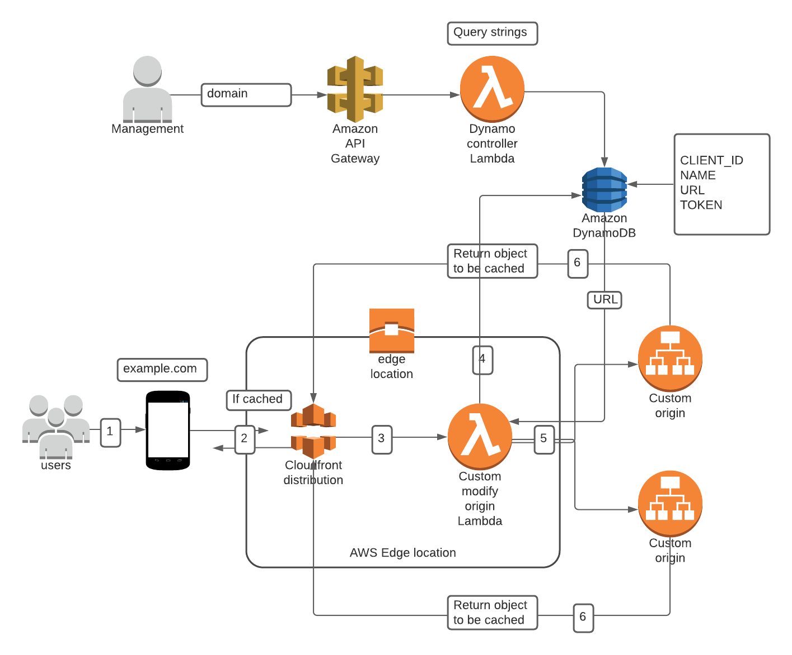

# API control


## The solution covers the following scenarios. 

1. Provide a single endpoint. 
2. Filter logic to parse a unique combination of parameters of the incoming request. 
3. Route based on filter logic.

## workflow
1. API to add a combination of Name and Token
2. Logic to map the combination of parameters to a deployment URL.
3. Ability to add new parameters in the future. 
4. Storage capabilities.
5. Logic to retrieve URL based on the combination of parameters.
6. Perform the business function of redirection to the correct URL. 
7. Route subsequent traffic to correct URL.
8. Cache regular responses. 

## Solution

The solution leverages AWS CloudFront, Lambda@Edge, DynamoDB and API Gateway. 

Amazon CloudFront is a fast content delivery network (CDN) service that securely delivers data, videos, applications, and APIs to customers globally with low latency, high transfer speeds, all within a developer-friendly environment.
CloudFront offers the most advanced security capabilities, including field level encryption and HTTPS support, seamlessly integrated with AWS Shield, AWS Web Application Firewall and Route 53 to protect against multiple types of attacks including network and application layer DDoS attacks. These services co-reside at edge networking locations – globally scaled and connected via the AWS network backbone – providing a more secure, performant, and available experience for your users.
CloudFront works seamlessly with any AWS origin, such as Amazon S3, Amazon EC2, Elastic Load Balancing, or with any custom HTTP origin. You can customize your content delivery through CloudFront using the secure and programmable edge computing feature AWS Lambda@Edge.

DynamoDB.  Amazon DynamoDB is a key-value and document database that delivers single-digit millisecond performance at any scale. It's a fully managed, multiregion, multimaster, durable database with built-in security, backup and restore, and in-memory caching for internet-scale applications. DynamoDB can handle more than 10 trillion requests per day and can support peaks of more than 20 million requests per second.

CloudFront real-time logs are delivered to the data stream of your choice in Amazon Kinesis Data Streams (log records are delivered within seconds of a viewer request). You can choose the sampling rate for your real-time logs—that is, the percentage of requests for which you want to receive real-time log records. You can also choose the specific fields that you want to receive in the log records. CloudFront real-time logs contain all the same data points as the standard logs and also contain certain additional information about each request such as viewer request headers, and country code, in a W3C extended format. CloudFront charges for real-time logs, in addition to the charges you incur for using Kinesis Data Streams. More information. 



## Specifics and Utilization

The solution is network agnostic. Meaning that it does not require a host VPC to work. The solution is coded and may be fully managed by terraform. 

### Management behavior

Management team will execute an API call to API GW in the form. 
```
curl -X PUT "https://yq8480wt3k.execute-api.us-east-1.amazonaws.com/put?customer_id=<Customer>&name=<Name>&url=<URL>&TOKEN=OIUI67678HKHIOK&appToken=LLKJL87983274DSF"
```

The query string will be parsed and the values stored in DynamoDB by the Lambda function.
The above will return a custom response, such as

```
{"HTTPStatusCode": 200, "date": "Wed, 25 Nov 2020 15:06:21 GMT", "RequestId": "F25LFQ5R4DCQQIM0OSO4NID0PJVV4KQNSO5AEMVJF66Q9ASUAAJG", "ResponseMessage": "Client has been added successfully"}
```

### Redirection behavior

1. The CloudFront distribution (single endpoint) will receive the initial request. 
2. The Lambda function (Lambda@Edge) will gather the headers in the request and perform the business logic by calling DynamoDB for URL.3. for the corresponding matching parameters. Lambda will modify the original origin request to the corresponding URL. 
4. The matching origin will respond to CloudFront, which will cache the response and deliver it to the requester. 
5. CloudFront will respond with the cached objects for subsequent requests depending on its configuration and the type of request. 
